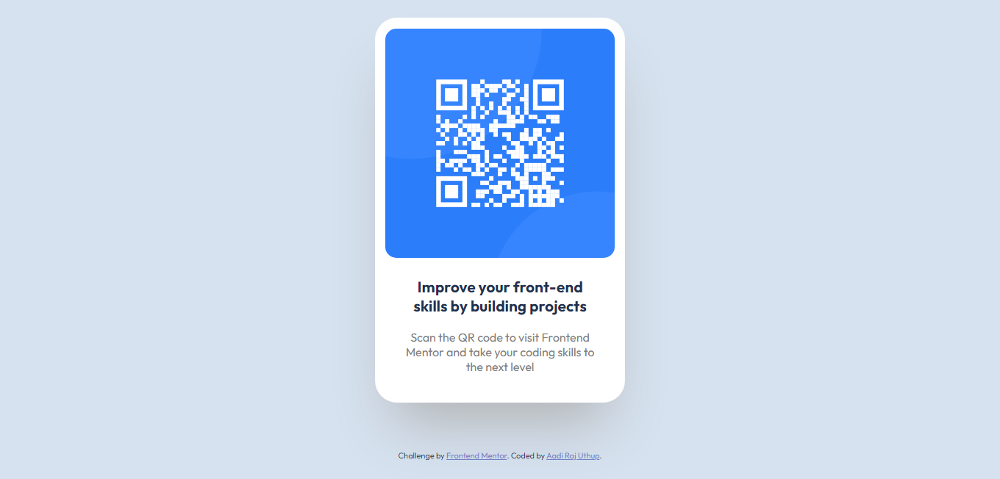

# Frontend Mentor - QR code component solution

This is a solution to the [QR code component challenge on Frontend Mentor](https://www.frontendmentor.io/challenges/qr-code-component-iux_sIO_H). Frontend Mentor challenges help you improve your coding skills by building realistic projects. 

## Table of contents

- [Overview](#overview)
  - [Screenshot](#screenshot)
  - [Links](#links)
  - [Built with](#built-with)
  - [Useful resources](#useful-resources)
- [Author](#author)

## Overview

### Screenshot

### Links

- Solution URL: [GitHub](https://github.com/aadirajuthup/qr-code-component-main)
- Live Site URL: [GitHub Pages](https://aadirajuthup.github.io/qr-code-component-main/)

### Built with

- Semantic HTML5 markup
- CSS
- Flexbox
- Mobile-first workflow

### Useful resources

- [MDN Web Docs](https://developer.mozilla.org/en-US/)

## Author

- Website - [Aadi Raj Uthup](https://direct.me/aadirajuthup)
- Frontend Mentor - [@aadirajuthup](https://www.frontendmentor.io/profile/aadirajuthup)
- Telegram - [@aadirajuthup](https://www.telegram.me/aadirajuthup)